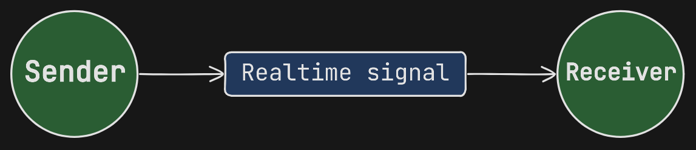
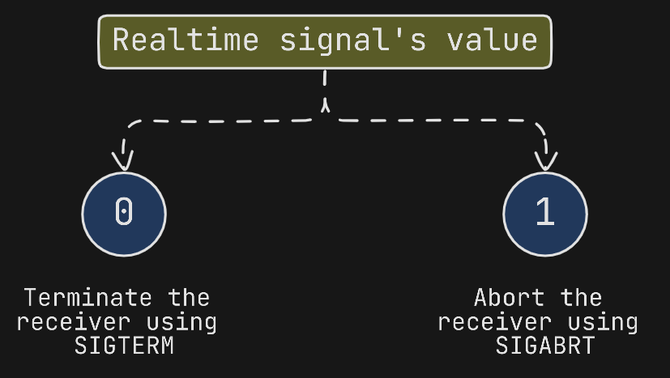
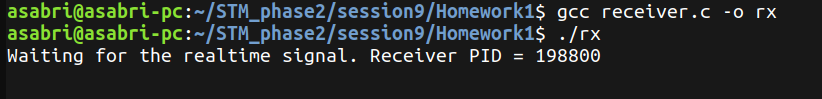
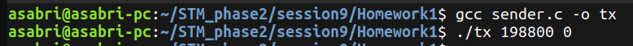
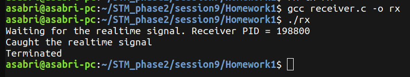
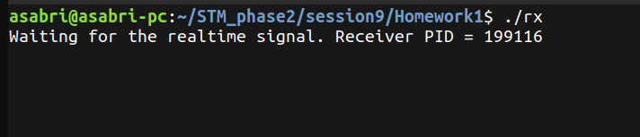
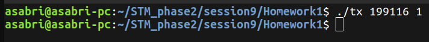
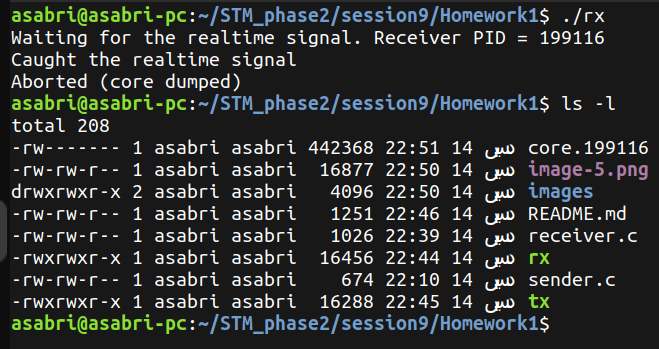

# Signals Task 1

## Overview
#### In this taks Real-time signals are used to simulate the signals terminate and abort between a sender process and a receiver process.



#### Depending on the value sent within the realtime signal, the receiver process will `terminate` or `abort`

## Compie and Run

#### 1. first of all, you need to enable the coredump to be created within the current working directory using the following commands:

```bash
ulimit -c unlimited 
sudo service apport stop
```

#### 2. Second, you need to compile and run the receiver using the following commands:
```bash
gcc receiver.c -o rx
./rx
```

You will notice an output like this:

```bash
Waiting for the realtime signal. Receiver PID = 123456
```

You will need this PID when you run the sender process. 

#### 3. You can compile and run it using the following commands:

```bash
gcc sender.c -o tx
./tx <pid> <value>
```

use the PID printed when you ran the receiver process. the value can be 0 or 1:


## Output Samples:

#### compiling and running the receiver:



#### compiling and running the sender with passing the PID and 0 as arguments:



#### recevier is terminated:



#### Using Abort signal:



#### Running the sender:



#### Coredump file creation:

